## Hi there 👋

<table border="0" cellpadding="0" cellspacing="0" width="100%">
  <!-- Baris 1: Dua kotak di atas berdampingan -->
  <tr>
    <td width="50%" valign="top" style="border: none;">
      
    </td>
    <td width="50%" valign="top" style="border: none; padding-left: 10px;">
      
    </td>
  </tr>
  <!-- Baris 2: Satu kotak di bawah tengah -->
  <tr>
    <td colspan="2" align="center" style="border: none; padding-top: 15px;">
      

        
      

    </td>
  </tr>
</table>

### 📈 Activity

  <!-- Contribution Streak Card -->
  

